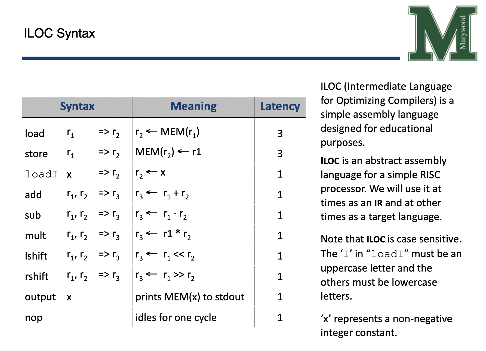

# ILOC Scanner Spring 2026

Marywood CS342 ILOC Compiler written in Java CS342

# Project 2: Scanner
For this assignment, you will start with the provided Scanner template.  You will be adding your own code to identify the token(s), using the Scanner methods provided to read the source file:
 <ul>
   <li>nextChar</li>
   <li>pushChar</li>
   <li>peekChar</li>
</ul>

You can view the Scanner JavaDocs [here](javadocs/index.html).

You will also provide errors for invalid syntax.

Tokens will contain the lexeme and category.

When errors of the scanner have been identified, you should provide the line and column that the exception occurred.

# ILOC (Intermediate Language for Optimizing Compilers)

# Resources
[Download Java 25](https://adoptium.net/temurin/releases/)

[Download git client](https://git-scm.com/install/)

[Download IntelliJ Student Pack](https://www.jetbrains.com/academy/student-pack/)
